# agent-context-runtime：MVP Architecture / Implementation Plan

> **STATUS: LEGACY RESEARCH BASELINE**
>
> This document records the frozen Context Optimization MVP and remains
> authoritative only for interpreting that historical research implementation.
> It is superseded for active MVP validation by
> [`agent-forensics-mvp-plan.md`](agent-forensics-mvp-plan.md).
> Do not continue M4 or duplicate-read intervention work unless separately
> reauthorized.

Python package：`acr`。唯一架构基线：《编码智能体成本感知上下文管理：研究工程架构 v0.1》。本文仅裁剪和冻结实施范围，不替换其研究纪律。

状态：待实施计划；未创建代码仓库、未执行实验、未验证收益。所有效果阈值均为 tentative。建议以 10 个工作日为时间盒；前提是能使用一个模型 API、容器执行环境及至少一个已可运行的任务环境。环境或凭据不可用时按 milestone 降级，不承诺用模拟实验代替真实闭环。

**MVP 定义：一个同步 runtime、一个 provider、一个任务套件、两种薄日志 adapter、从头配对运行、noop + 一种确定性干预、一份可追溯报告。** 不做中间 checkpoint。单次运行至多干预一个请求中的一个旧副本。先形成可信证据，再研究收益规模。

## A. v0.1 → MVP 裁剪决策表

P0：本轮确实编码并测试。P1：保留字段/函数边界/能力标记，只有最小实现。P2：仅文档说明，不写实现或空类。

| v0.1 模块/能力 | 级别 | MVP 决策 | 为什么现在必须做，或为什么能延后 |
|---|---|---|---|
| raw ingest、来源与不可变存储 | P0 | 本地原件 + sha256 + manifest | 没有原件无法复查；不做远程数据同步平台 |
| 统一 contracts、身份与 unknown | P0 | 一个 contracts.py，schema 1.0 | 防止错配和捏造信息；不实现通用迁移引擎 |
| 多 trajectory adapter | P0 最小 + P1 扩展 | 原生 acr capture + 一种固定版本历史日志 | 两种输入验证边界；不做多格式全覆盖 |
| 多 task/benchmark adapter | P0 一个 + P1 接口 | 一个任务套件的公开/私有输入拆分 | evaluator 隔离必须有；第二套件延后 |
| provider/runtime adapter | P0 一个 + P1 接口 | 一个 provider，单进程同步 agent loop | 只有这一个需要达到 L3；历史日志可停在 L0 |
| Request observer / compiler | P0 | 保存发送前、实际出站 body 与块映射 | 否则不能证明干预生效 |
| 字段级 provenance | P0 | JSON Pointer 引用 + 转换版本 + 输入列表 | 小数据可直接遍历；不建图数据库 |
| repository/file state | P0 | 初始工作区核验、读取字节绑定、决策时重读 hash | 足够支持唯一干预；不恢复历史执行世界 |
| 完整 checkpoint restore / fork | P2 | capability=false | 从头配对即可形成闭环 |
| shell/session/background/external state recovery | P2 | 不支持；运行任务禁止依赖这些能力 | 缺少时拒绝该任务，而非模拟恢复 |
| 复杂 causal graph、并发事件依赖 | P2 | P0 用本地同步完成序号 + call_id | 串行执行能保证前缀；历史并发轨迹无法确认则降级 |
| AST / symbol dependency、范围重映射 | P2 | 文件 hash + 明确完整读取 | 首个操作不需要语义依赖 |
| visibility / anti-cheating | P0 | 固定白名单、run 内前缀、污染标签、隔离 evaluator | 少量规则就能阻断关键泄漏，不做通用权限框架 |
| candidate detection | P0 | 唯一精确重复规则 | 没有候选就没有干预实验 |
| W01–W08 全量迁移 | P1 | 保留 rule_id/source evidence，首版不移植全部规则 | 不属于唯一操作的前置条件 |
| intervention / receipt | P0 | noop + 一次旧副本省略，发送证据确认 | intent 不等于生效，必须分开 |
| paired rerun | P0 | 两个干净实例从头运行 | 无需 checkpoint；不得沿用历史后缀 |
| accounting | P0 | physical attempt、原 usage、固定价格快照、wall/CPU spans | 不漏 cache、失败、管理器与重试 |
| 发票自动对账、全 provider 计价 | P1 | cost evidence flag；一个 provider 映射 | usage_priced 可先做，但不得叫已核实账单 |
| cache instrumentation / 顺序平衡 | P0 | cache usage、初始状态 unknown、AB/BA 随机平衡 | 控制暴露并披露不可控因素 |
| 完整 cache namespace isolation | P1 | `cache_isolation=unsupported`；不实现隔离器 | 先做条件性 feasibility；不能声称严格缓存因果隔离 |
| evaluator / patch validity | P0 | 一个既有 evaluator 的薄封装 | 不重写 benchmark 判分规则 |
| audit | P0 | 来源、身份、请求、时序、权限、状态、成本、配对检查 | 不通过就没有可信实验 |
| experiment orchestration | P0 最小 | 顺序 for-loop + manifest + CLI | 不需要通用 DAG 调度器；阶段分别运行 |
| distributed orchestration / queues | P2 | 不实现 | 10–20 个任务不是引入分布式系统的理由 |
| cache / resume of research artifacts | P0 最小 | 输入与配置 hash；确定性产物复用；中断 run 从头新建 | 避免重复花费但不伪造独立样本 |
| artifact/report | P0 | JSON/CSV/Markdown 配对表、账本、审计摘要 | 必须能从已有证据重新出报告 |
| SQLite、Parquet、dashboard | P2 | JSON/JSONL 与本地 blob 足够 | 不为尚未出现的规模瓶颈开发 |
| learned policy、RL、runtime controller | P2 | 不实现 | 还没有可靠训练标签或收益证据 |
| semantic compression、长期记忆、多模型路由 | P2 | 不实现 | 增加变量，破坏首轮可归因性 |

P1 不等于“先搭一个空框架”。一个 `false`、一个 Protocol 或一个纯函数签名已经足够。

## B. MVP 架构图

```mermaid
flowchart TD
    A[raw 原件与两种日志 adapter] --> B[contracts + provenance + audit]
    T[白名单任务与初始工作区] --> R[从头运行 baseline / treatment]
    B --> O[离线资格与证据报告]
    R --> V[当前请求 + 文件状态 + DecisionView]
    V --> C[精确重复候选]
    C --> I[noop 或单次省略]
    I --> S[实际发送与独立执行]
    S --> V
    S --> F[终止并封存 run / patch]
    F --> E[隔离 evaluator]
    X[私有评测资源] --> E
    E --> O
    S --> B
```



图中的循环只在当前 run 内执行。baseline 与 treatment 各自拥有独立工作区、消息历史和 raw evidence。历史 raw 数据不能自动成为运行起点；它只供离线审计。在线 runtime 的每次请求、工具结果与响应首先写原件，再生成对应规范对象，因此在线实验本身也具有完整的 raw → normalized → provenance 链路。

不新增服务：运行宿主调用纯函数并控制工具容器；运行期间不加载私有评测数据。评测是另一次独立命令/进程，读取封存产物。Agent 工具容器不能访问宿主数据根目录。

## C. 最小目录结构与接口

```text
agent-context-runtime/
  pyproject.toml
  README.md
  src/acr/
    __init__.py
    contracts.py
    ports.py
    store.py
    provenance.py
    audit.py
    visibility.py
    state.py
    candidates.py
    interventions.py
    accounting.py
    evaluation.py
    reporting.py
    experiment.py
    cli.py
    adapters/
      __init__.py
      native.py
      legacy.py
      taskset.py
      provider.py
    runtime/
      __init__.py
      runner.py
      tools.py
  configs/
    pilot.json
    prices.json
  tests/
    fixtures/
    test_contracts.py
    test_adapters.py
    test_audit.py
    test_visibility.py
    test_state.py
    test_runtime.py
    test_intervention.py
    test_accounting.py
    test_evaluation.py
    test_e2e.py
  docs/
    mvp-scope.md
    contracts.md
    metrics.md
```

**必须独立的逻辑边界**：contracts、visibility、state、candidate、intervention、accounting、evaluation。它们可以各为一个文件，但不能把候选判断写进 provider adapter，或让 candidate import evaluation。尤其 evaluation 与 runtime 必须独立进程执行。

`store.py` 同时处理 raw blob、JSONL append 和 manifest 原子提交；`experiment.py` 同时负责配对 preflight 和顺序编排；`provenance.py` 只实现引用解析/传播，不做 DAG 服务；`audit.py` 用规则函数列表，不做插件注册系统。

采用一个数据验证方案，建议 Pydantic 模型与普通函数；不再平行维护手写 dataclass、另一套 schema 模型及 ORM。大字段存在 blob，模型存引用。配置 JSON 足够，不引入额外配置 DSL。

第一天在 `ports.py` 仅保留四个小 Protocol：

```python
class TrajectoryAdapter(Protocol):
    def normalize(self, raw_ref: str) -> NormalizedBatch: ...

class Provider(Protocol):
    def prepare(self, request: RequestDraft) -> PreparedRequest: ...
    def send(self, prepared: PreparedRequest, attempt_id: str) -> ProviderResult: ...

class Runtime(Protocol):
    def run(self, task: AgentTask, spec: RunConfig, intervention: str) -> Run: ...

class Evaluator(Protocol):
    def evaluate(self, sealed_run: Run, private_spec_ref: str) -> EvaluationResult: ...
```

上述辅助名仅是函数输入输出类型，不都升级为持久化顶层 schema。Provider.prepare 的目的，是让核验过的载荷与真正发送的载荷关联；真实出站 body 仍需捕获，不能信任一个“prepared”变量名。

其余留函数接口即可：`build_view(...)`、`compare_file(...)`、`detect(view)`、`apply(plan, draft)`、`price(raw_usage, price_snapshot)`。candidate/intervention 不值得做基类继承树；taskset.py 用 `prepare_task()` 返回公开输入、初始快照与私有评测引用，后两者由正确的调用域持有。

数据目录由 `--data-root` 指定且不放进 Agent 工作区：`blobs/`、`imports/`、`runs/<id>/`、`pairs/<id>.json`、`reports/`。每个 run 一个 events.jsonl，其他对象按类型保存 JSONL。评测私有目录另设且不挂载给 runtime；没有数据库服务器。

## D. 第一版核心 contracts 与最小状态

### D1. 公共规则

schema 从 `1.0` 开始；这是实现版本，不把 v0.1 文档号当格式号。每个持久化对象统一 envelope：

`kind, schema_version, id, producer_ref, provenance_ref`。

producer_ref 指向保存 code commit、配置 hash、格式版本的 manifest，不在每行重复一大段。id 标识逻辑对象或执行身份；blob sha256 只标识内容。重复文本可来自不同真实工具调用，不合并其身份。

观察或派生字段采用小型 `Fact[T]`：

```json
{"value": null, "status": "unknown", "reason": "not_captured", "refs": []}
```

status 保留 `observed | derived | estimated | unknown | not_applicable`。已声明的 ID、常量和 schema 字段不必全套 Fact；它们由 envelope 或配置来源解释。会影响决策/主指标的 payload 字段必须有 Fact 或字段级 provenance 路径映射。unknown 用 null + reason；observed/derived 必须有 refs。原件字节与 provider 回报是观测事实，其解释/汇总是派生事实。

最小信息标签：`scope=public|runtime|evaluator|analysis`、`run_id`（任务公开常量可为空）、`available_seq`、`taints[]`。标签放在引用或对象上；混合对象默认整体从严，task adapter 再按字段显式投影。未知标签不可进入 DecisionView。

### D2. 必须持久化的最小对象

下表均隐含公共 envelope；Fact 用于可能未知的字段。

| 对象 | 第一版字段 | 不允许省略的语义 |
|---|---|---|
| EvidenceRef（嵌套） | blob_hash、source_id、trajectory_key、locator、labels | locator 用 JSON Pointer 或字节范围；导入原件另有来源 URI/revision/许可 manifest |
| Event | run_id、event_seq、source_position、kind、call_id、payload_ref、available_seq、start/end | 原生 event_seq 为同步 runtime 权威序号；历史行号放 source_position，不能自动冒充可见序号 |
| RequestSnapshot | run_id、logical_call_id、attempt_id、cutoff_seq、before_body_ref、sent_body_ref、ordered_blocks、model_config_ref、transport_status、provider_request_id | before 是本次干预前草稿；sent 是实际出站 body，服务端内部输入仍 unknown |
| ContextBlock | request_id、occurrence_id、origin_event_id、role/type、tool_call_id、body_pointer、content_hash、complete、file_binding | occurrence 标识当前请求里的一个位置；同一历史块可出现在很多请求 |
| RepositoryState | run_id、initial_tree_hash、image_digest、observed_seq、files[]、state_caps | files 是已观测文件集合，不能宣称覆盖全运行状态 |
| FileBinding（嵌套） | repo_relative_path、file_sha256、range=full、encoding、read_event_id、observed_seq、complete | hash 来自与工具输出同一次读取的原字节；不从命令字符串猜来源 |
| FileComparison（嵌套） | binding_ref、current_file_sha256、checked_seq、status、reason | status=same/changed/unknown；不存在或无法安全读取时保守 unknown |
| DecisionView | run_id、cutoff_seq、request_draft_hash、blocks、file_comparisons、policy_version、labels | 只投影策略实际需要的字段；不含费用结局、评测或整条轨迹 |
| Candidate | run_id、view_id、rule_version、older_occurrence、newest_occurrence、evidence_refs、confidence_tier、preconditions | confidence_tier 固定 rule_high，不是概率，更不是冗余真值 |
| InterventionPlan | candidate_id、expected_request_hash、target_pointer、replacement_text、expected_file_hash | 唯一 op=omit_one_duplicate_read_v1；保留最新完整副本 |
| InterventionReceipt | plan_id、status、reason、before_hash、prepared_after_hash、sent_request_id、actual_sent_hash、changed_pointers、started/ended | status 区分 rejected/prepared/sent/accepted/send_unknown；prepared 不算实际生效 |
| Run | task_id、config_ref、capabilities、initial_state_ref、start/end、status、stop_reason、events_ref、sealed_artifact_ref/hash | config 固定模型、scaffold、工具、预算；旧轨迹导入 run 的未观察配置标 unknown |
| Pair | task_id、replicate_id、baseline_run_id、treatment_run_id、manifest_hash、execution_order、preflight_result、status | mode 固定 from_scratch；run 重试不能覆盖原 run_id |
| EvaluationResult | run_id、submitted_artifact_hash、evaluator_revision、status、patch_valid、tests_executed、passed/failed、resolved、raw_result_ref | status 区分 completed/infra_error；infra_error 的 resolved=unknown |
| CostEntry | run_id、attempt_id/resource_id、caller、phase、category、quantity/unit、rate_ref、amount/currency、evidence_level、raw_usage_ref、dedup_key | amount 可未知；类别互斥；所有已计费失败/重试保留 |
| Provenance | output_object/field、input_refs[]、transform_name/version、config_ref | 原件叶节点不要求递归来源；生成常量的输入可为配置字段 |
| AuditFinding | rule_id/version、severity、scope/object_ref、evidence_refs、action、message | severity=block/warn/info；block 不允许被报告脚本静默忽略 |

Event.payload 用有限 tagged union：request、response、tool_start、tool_finish、state_check、decision、manager_span、run_stop；没有独立 AgentAction/ToolResult/Span 顶层体系。Trajectory 只是导入 manifest 中的映射列表；SourceRecord、RunSpec、PairSpec 合并到 manifest/Run/Pair。这样保留语义，削减类型数量。

AgentTask 与 PrivateEvalSpec 仍须拆分，但可作为两个配置 JSON，而非再建对象框架。核心 Task 只含 namespaced task_id、公开题意、初始工件引用、允许工具和预算；benchmark 特有测试名、patch 字段只能留在 taskset adapter 的私有输入中。

### D3. 第一版 State 的严格范围

能力分为三个独立 flag，避免“文件已验证”被误读成“整个运行可恢复”：

| 能力 | 值 | MVP 要求 |
|---|---|---|
| initial_repository | unknown / verified | 从头实验必须 verified；包括允许的文件、模式/链接和初始额外文件清单 |
| file_binding | unavailable / read_bound / current_verified | 候选必须 current_verified |
| execution_restore | unsupported | 所有 MVP run 恒为 unsupported |

展示级别可写 S0 无可信文件绑定、S1 已绑定读取版本、S2 决策时已核验该文件当前版本。S2 只对被检查的文件成立，绝不表示全仓库实时快照。

runtime 提供窄的 `read_file(path)` 工具：只读工作区内普通 UTF-8 文件，完整读取或明确标 truncated；同一次字节读取生成输出和 hash。第一版候选只识别该工具的完整输出。shell 的 `cat`、search 片段、符号链接、二进制、编码不明、超限文件一律不猜 file binding。

在无在途工具的请求边界，state.py 对候选文件重读并比较 hash，管理器读取/哈希开销计入 treatment。为防变化竞态，工具串行，禁止后台写进程；发送前的核验与修改处于无工具并行的临界段。无法保证这个前提时该文件 comparison=unknown 并拒绝干预。

same 要求路径、完整字节 hash 与当前读取一致；changed 仅说明字节变化，不说明旧内容无用；unknown 不触发干预。路径按真实工作区边界校验，不允许 `..` 或链接逃逸。第一版删除/重命名导致无法读取可直接 unknown，不实现 lineage。

初始实例无法干净创建、初始 tree 不匹配：阻断 pair。运行中某个文件绑定无法核验：仅拒绝该候选，继续合法 noop。存在泄漏或证据链破坏：停止并隔离 run。三种情况不能统称“失败后继续”。

### D4. 兼容扩展规则

未来可以加 optional metadata、provider 原字段引用、额外成本类别、更多文件绑定类型；旧字段含义不可改变。新枚举/操作不应假定旧 reader 能理解：旧 reader 不支持就显式拒绝或用途降级。major 不兼容版本直接隔离；minor 的声明性元数据可保留但不参与决策。不开发自动迁移引擎，保留原件即可后续重规范化。

## E. Runtime capability levels

level 是证据与已测能力的摘要，不是工具自报身份。下面按累积能力定义；另加独立的 state、usage、evaluation flags，避免一个 L3 掩盖计费缺失。

| 等级 | 必备证据/能力 | 允许研究 | 禁止结论 |
|---|---|---|---|
| L0 Log-only | 原始日志、可审计解析 | 日志统计、格式/重复/缺失审计 | 真实模型输入、实际删减、干预收益 |
| L1 Request-observable | L0 + 实际客户端请求捕获和时序关联 | 当前请求重复暴露、输入组成 | 实际干预有效、任务因果收益 |
| L2 Request-interceptable | L1 + 合法修改出站请求 + receipt/出站验证 | 干预是否真的发送、协议兼容性 | 没有配对重跑与评测却宣称质量/成本收益 |
| L3 From-scratch paired rerun | L2 + 固定初始环境、配置、独立两组运行、封存补丁 | 从头策略的任务级 feasibility | 同一中间状态的候选因果效用、确定性复现 LLM 输出 |
| L4 Checkpoint-fork | L3 + 经验证的完整 checkpoint 与隔离分叉 | 可开展局部配对续跑 | 仍不能把单次结果视为天然 utility ground truth |

MVP 自采 runtime 目标 L3；legacy adapter 通常 L0，只有实际证据支持才上调。L4 不实现。

运行前检查 `required capabilities`：L0/L1 输入可导入与出离线报告，但不能调用 paired-rerun。L3 + `evaluation=verified` 才计算任务质量；L3 + `usage=complete` 且有价格证据才出对应计价指标；usage 不全保留执行，净收益标 unknown。离线解析成功不意味着任务环境可运行。

历史事件排序不确定：保留 source_position，available_seq=unknown，拒绝进入在线 DecisionView。不构造复杂因果图挽救第一阶段数据。

## F. MVP anti-cheating protocol

### F1. 最小白名单和隔离

1. Agent 可见：公开题意、允许的初始仓库、固定系统/工具定义、自己的既往响应和已完成工具结果。模型 API 凭据在宿主，不进入工具容器。
2. Runtime manager 可见：上述合法信息 + 当前请求块、合法 read_file 的来源/hash、候选文件当前 hash、截至当前的本 run 管理记录。额外管理信息不自动注入 Agent prompt。
3. evaluator-only：gold/test patch、隐藏测试资源、判分配置和最终标签。它们不进入 AgentTask，不挂载给工具容器，不加载到在线候选进程。普通初始仓库公开测试允许使用。
4. 运行阶段宿主只读公开任务 manifest。封存后单独启动 evaluator，读取私有 spec，在新的干净评测实例里应用生成补丁。不能直接信任 Agent 已修改过的测试目录。
5. 工具容器只挂载自己的工作区与必要只读依赖；不挂载 `.git` 未来对象、其他 run、报告、原始 evaluator 数据、Docker socket。网络关闭；依赖预先准备。模型通信由宿主 provider 完成。
6. 候选器唯一签名 `detect(view: DecisionView)`，纯函数，不接收路径、store、Run、Evaluator 或任意查询回调；测试检查其模块不 import evaluator/store/provider，不执行 I/O。这里不声称防御恶意 Python 插件：第一版只运行自有受审计确定性规则。

### F2. 前缀与 taint 最小规则

同步 runtime 为每个完成事件分配递增 available_seq；决策的 cutoff_seq 是本次请求前最后一个已完成事件。Candidate 不能读取尚未完成工具的结果。事件来自相同 run，且 available_seq ≤ cutoff_seq。

provenance 派生执行：`taints = union(inputs.taints)`；`available_seq = max(inputs.available_seq)`（有未知则未知）；混合 run 拒绝；scope 取更严格者。任务公开常量不参加 run 冲突，使用公开任务授权来源。禁用标签包含 evaluator/gold/test_patch/posthoc；未来不是靠删一个 future 标签释放，而是每次按 seq 检查。摘要、hash、复制等都不清除污染。

DecisionView builder 仅用白名单投影，完成全部来源闭包检查后才产生 view。污染、跨 run 或权限不明导致 block，停止该 run 并记录；文件状态不足等普通能力问题只 abstain。拒绝不能靠把缺失字段填默认值“修复”。

### F3. 10 个必须通过的 adversarial fixtures

| 测试 | 输入/攻击 | 必须结果 |
|---|---|---|
| 1 未来替换不变性 | 固定 prefix，替换追加的答案/成功事件 | view 与候选输出完全不变；不得扫描后缀 |
| 2 未来来源拒绝 | 旧 event 混入 available_seq 大于 cutoff 的字段 | block，不允许回填较早 seq |
| 3 evaluator 字段诱饵 | benchmark 行含 resolved/gold/test_patch | 公开任务投影不含这些字段；decision 强行引用则 block |
| 4 污染不能洗白 | 对隐藏补丁做 hash/摘要再传候选 | 派生 taint 保留并拒绝 |
| 5 跨分支引用 | treatment 读取 baseline 的后续事件 | run_id 不匹配，block |
| 6 未完成工具 | tool_start 后尚无 finish 就提供结果 | 不分配合法可见序号，不进入 view |
| 7 文件访问逃逸 | `../eval_private`、工作区链接指向私有目录 | 容器不可见且 read_file 路径拒绝；不只依赖字符串过滤 |
| 8 环境答案残留 | 未来 git 对象/隐藏测试/旧评测报告诱饵 | 运行工作区不可访问；preflight 失败时不启动 Agent |
| 9 来源与标签缺失 | 将未知标签默认为 public，或截断 provenance 链 | 验证失败；unknown 不可用于候选 |
| 10 evaluator 回流 | 在 run 未封存时评测，或将结果注入消息历史 | evaluate 命令拒绝；runtime 不接收该消息类型 |

这些测试保证本工程的已知泄漏边界，不证明基模没有训练数据污染，也不实现通用恶意容器防御平台。

## G. 第一条 pilot experiment

### G1. 固定一个执行选择，不开展框架选型调研

在已有能运行的 task/evaluator 环境上接一个最小同步 API agent loop，放在 runtime/runner.py。固定一个 provider、一个模型版本/请求模型标识、一个 scaffold。工具最小保留 read_file、search、编辑/执行测试所需操作；工具调用串行，shell 每次独立启动，不承诺持久会话和后台任务。

M0 锁定一套已有可跑的任务环境，不新建 benchmark。本计划不假定当前已有哪套环境或密钥；这些是开工输入，必须写入 configs/pilot.json。两天内不能跑通一个真实任务，就停止扩大任务接入，先做明确标注的合成工程 fixture；它不能计入真实 feasibility 的任务数或收益。

两个日志 adapter：native.py 读 acr 自采原件；legacy.py 只支持一份实际取得、固定版本的前置 Claude Code/历史日志样本。拿不到原件则保持 unsupported，先交付 native 闭环；不能编造历史字段把 M1 宣称为两种真实来源通过。

### G2. 唯一干预：omit_one_duplicate_read_v1

对当前待发请求里的 read_file 输出建立精确键：

`(normalized_path, file_sha256, full_read, encoding, output_bytes_hash)`。

仅当至少两个**不同真实 read 调用**的完整输出具有相同键，且该文件当前 hash 仍相同，才可成为候选。序列化时重复打印同一个调用不是此类候选，要先当数据重复审计。

确定性选法：按请求顺序找第一个符合条件的旧副本，以其同组最后一个完整副本为保留对象。原始工具输出、当前请求中的两个内容块都要逐字节核验；仅 hash 一致不足以弥补缺失原件。

操作：只替换最旧一个 tool-result 的正文，保留角色、位置、tool_call_id、工具协议字段和最后完整副本。固定英文标记：`[Earlier duplicate file read omitted; the later complete read remains in this request.]`。标记自身进入输入和成本计量。若标记字节长度不短于原文，abstain；不声称字节差等于 Token 差。

**作用范围冻结：每个 treatment run 至多选择一个候选、尝试一次；只修改该次出站请求。之后按原始历史正常构建请求，不建立持久省略状态。** 这主动牺牲收益空间，换取最小修改边界；以后持久省略是另一个实验版本，不静默加进来。若首次候选验证失败，本 run 不继续寻找更有利的候选。

候选器不读取 outcome，也不按最大预计收益挑任务。计划生成后再次检查 request hash、目标路径、完整副本与文件状态；任一未知/改变则 reject。API 拒绝是 treatment 失败证据，首版不自动改回原文重试；若使用网络重试，只按两组一致的冻结规则发送相同载荷并独立记账。

### G3. Baseline 与 Treatment

| 项目 | Baseline | Treatment |
|---|---|---|
| 初始任务/镜像/工作区 | 同一固定快照，新实例 | 同一固定快照，新实例 |
| provider/model/scaffold/tools | 相同 | 相同 |
| 上限/停止/网络重试规则 | 相同 | 相同，包含管理开销 |
| 记录器与基础 raw capture | 启用 | 启用 |
| 策略 | noop，不额外跑 shadow detector | 一次候选检测序列与至多一次省略 |
| 后续执行 | 自主从头执行到终止 | 自主从头执行到终止 |
| 隐藏评测 | 封存后独立评测 | 封存后独立评测 |

固定公共 read_file 输出来源采集属于共同 instrumentation；treatment 独有的重复扫描、文件重读、计划、验证、receipt 生成是管理开销。请求 raw evidence 两组都捕获。不要在 baseline 额外执行同等 manager 工作把开销藏掉。

### G4. 实际执行步骤

1. 一个合成 wiring fixture 确保有重复读取，仅验证链路和 receipt；可以使用 scripted model，但明确没有真实效果结论。
2. 一个真实模型任务 smoke，验证工具、patch、评测、计费；自然无候选也如实记录。
3. 冻结 10–20 个可执行真实任务清单、单一模型/操作、预算、ε 与指标口径。任务只按环境可运行和公开元数据选择，不根据结果或重复频率筛选。
4. 每任务一对从头独立执行，AB/BA 顺序用保存的随机种子平衡；各自从干净实例开始。无需输出序列相同。
5. 收集 raw → normalized → provenance/audit → request/state → Candidate/Receipt → sealed run → EvaluationResult → ledger/report。
6. 报告所有任务，包括无候选、reject、失败、超时、基础设施缺失及成本。

cache isolation 不可用就 `initial_cache=unknown`，记录请求时刻、前缀/设置及实际 cache usage。禁止声称 cold-cache 或完全消除跨 run 缓存干扰。AB/BA 平衡降低顺序偏差但不是隔离证明；报告按执行顺序的原始配对差异。没有完整 cache 证据时只做限定条件下的 feasibility，不把收益解释成纯文本省略的缓存无关效应。

如 10–20 个真实任务完全没有候选：工程 fixture 可验收“操作能执行”，真实 pilot 结论是“自然覆盖不足，尚无实际干预收益证据”。不能人为安排真实 Agent 重读来制造收益。

### G5. 指标与 MVP 不可回答的问题

Primary：`ΔQ = mean(resolved_t - resolved_b)`；`S = 1 - ΣC_t/ΣC_b`。主成本包含整条运行的 Agent API、失败/重试、可定价工具/环境与增量 manager；评测和共同研究 instrumentation 另账。API/本地成本无法完整货币化时分别报告 API 净成本、资源时长；总体货币净成本标 unknown，不把后者填零。

10 个任务的一个成功差异就是 10pp，20 个任务是 5pp；这样的样本不能证明 3pp 或 5pp 非劣。展示配对四格、每任务差值、样本数和探索性不确定性，不将未观察到下降当保证。

15%–20% 和质量下降 ≤3–5pp 继续保留为 tentative 研究目标。单次单请求省略可能收益很小，此轮先验收“可测”，不为了达标扩大干预范围。

辅助目标：≥70%、≤5%、≤10% 都不是工程链路通过与否的唯一判据。泄漏/对齐/记账失效是硬阻断；辅助收益阈值未达不是自动判研究无效。

**≥70% 的明确降级**：v0.1 的局部候选有效率需要同一 checkpoint 配对，这次不具备，因此 `local_candidate_effectiveness=not_supported`。MVP 另报“单次策略联合成功代理率”：在所有预先选中的高置信候选尝试中，receipt 证明已发出且 provider 接受、pair 评测有效、两组都成功、净成本下降至少 ε 的比例。ε 在 pilot 前写明，不看结果后改；拒绝和缺失不贡献成功，缺失数量另列。无候选分母 0 时为 not_applicable。

此代理是任务级随机运行的联合观测，不是候选 causal utility，也不是已验证的 70% 原指标。未来计算真正局部有效率必然需要新的 L4 实验；再完整的日志也不能补造不存在的反事实。主结果仍在整个预注册任务集合上报告，不能只报有候选的子集。

## H. 7 个开发 milestone

工期为顺利情况下的工作量预算，不是强迫跳过 gate 的 deadline。M1 的第二来源缺失不能阻塞 native 链路实现，但须标记该子目标未通过。

| Milestone | 目标 / 输入 | 产物 | 必须通过的 tests | 不做什么 | 失败降级 |
|---|---|---|---|---|---|
| M0 Contracts，D1 | v0.1 + 本裁剪计划；锁定输入环境 | contracts/ports、最小配置、来源/指标约定 | schema round-trip；unknown 与 0 区别；身份不等于内容 hash；禁用字段标签 | 不完善所有未来 schema，不实现迁移框架 | 先合成 fixture；未锁定环境不可承诺 M5 |
| M1 Two adapters + offline audit，D2 | 原生 fixture + 固定版本真实 legacy 原件 | native/legacy、store/provenance/audit、导入报告 | 重复导出不重复计；真实重复调用保留；malformed 隔离；来源可定位；历史未知请求不上调 L1 | 不接第二 benchmark/第三日志格式 | legacy 无样本/版本未知则 unsupported；保留 native 工作，明确 M1 部分验收 |
| M2 Trusted runtime，D3–D4 | 一个模型接入、可运行任务镜像、M0 contracts | runner/tools/provider、state、visibility、accounting、evaluator 薄封装 | 出站 body 捕获；读字节/hash 一致；初始树核验；失败调用记账；十项泄漏 fixture；补丁/hash 评测对齐 | 不恢复 checkpoint，不做并发/会话/联网任务 | 环境不可跑退工程 fixture；缺 usage 只报已知成本；不足 L3 不进真实配对结论 |
| M3 Noop / A-A，D5 | M2 的一个 smoke + 3 个小任务 | pair runner、noop report、A/A 原始四格 | 确定性 fixture 的 noop body 不变；两实例初态一致；反复 report 不重复计；真实每组独立调用 | 不要求随机 LLM 输出相同，不用 A/A 相同证明确定性 | 控制变量不匹配则停配对；provider 漂移记录未知并限定用途 |
| M4 One intervention，D6 | M3 + 重复读取 fixture | candidate/plan/receipt、唯一操作、完整工程证据包 | 仅目标正文改变；最近副本保留；文件变化/截断/来源缺失拒绝；协议 ID 保留；一次上限；sent=计划后载荷 | 不加第二操作，不做持久省略，不用 LLM judge | 无真实候选不造命中；结构不兼容则 reject，先修协议边界 |
| M5 Feasibility，D7–D9 | 冻结 10–20 task manifest、预算和价格快照 | 全任务 pairs、raw/normalized、评测、成本/诊断报告 | 全体流转数守恒；每个纳入 pair 有资格与对齐证明；每项主指标来源完整；中断/重试不被覆盖 | 不调参刷结果，不宣称非劣，不事后改任务集 | 资金/基础设施不足按原任务表报缺失；收益不明如实 uncertain；缺关键证据对应指标 unknown |
| M6 Decide，D10 | M5 全报告与异常清单 | go/hold/stop 决策、最多一个后续问题 | 人工抽查每个生效干预及所有质量损失/异常；从封存产物离线重建同一报告 | 不立即上学习器或新 benchmark | 先修测量；覆盖不足则 hold 操作；机制无收益亦保留底座 |

## I. 各 milestone 验收标准与总 Definition of Done

| Milestone | 可独立判定的验收门槛 |
|---|---|
| M0 | 所有已冻结对象可验证/序列化；未知、来源、权限语义有反例测试；配置缺关键项即拒绝启动 |
| M1 | 每种支持格式至少一条真实记录能定位到原字节字段；所有坏样本都有 finding；相同原件重复 ingest 幂等。无第二真实来源则如实标部分完成 |
| M2 | 至少一个真实任务从干净环境完成运行→封存→独立评测；每个模型 attempt 有实际发送证据和 usage/明确 unknown；10 项泄漏测试均通过；execution_restore=false |
| M3 | noop deterministic fixture 的模型 body 无未声明差异；3 个小任务的 A/A 均有两次实际独立运行和完整账本，随机结果可不同；基础设施错误无静默重试 |
| M4 | 工程 fixture 至少一个 receipt 通过 actual sent 核验；每次只改允许正文；其余故障 fixture 全部拒绝。只在 mock 生效必须明确标 mock，真实 provider 接受仍是未完成项 |
| M5 | 预注册任务全部有完成/失败/缺失状态；10–20 task 是目标不是伪造分母；所有主分析 run 无未解决 BLOCK；报告有无候选覆盖与所有失败成本；至少一个真实生效例子才能声称自然干预链路已验证 |
| M6 | 一个命令只读封存产物重新生成相同数值报告；说明 measurement、coverage、quality、cost 四方面是否支持扩展；不得用目标达标替代证据完整性 |

第一条完整可信真实链路的 DoD：一个真实任务 pair 初态/配置一致、两组实际独立从头运行、treatment 有自然候选并合法发送修改、两个封存补丁由隔离 evaluator 评测、所有成本条目可追到原件、无已知 BLOCK、报告可离线重建。任务可以失败、收益可以为负；那是有效负结果。

只有合成 fixture 生效：可说工程链路已连通，不能说真实任务上的干预链路已验证。只有 noop 真实任务：可说执行/评测底座可信，不能说干预有效。这个区别是验收的一部分。

## J. MVP 必须记录的 instrumentation 字段

原则：原始字节和不可逆执行事实现在采集；分类、图表和统计可以以后离线重算。下表的字段分散在前述对象与 manifest 中，不新建复杂观测系统。

| 字段组 | 至少记录 | 支持什么 / 缺失如何处理 |
|---|---|---|
| 实验控制 | experiment/pair/run/task/replicate ID、arm、order、code/config hash、模型请求标识及实际返回标识、scaffold/tool/prompt 版本、镜像与初始树 hash、预算、seed 支持情况、task inclusion/exclusion | 配对可比、重复/缺失；模型具体 revision 未提供则 unknown，不能声称完全版本冻结 |
| 来源 | source URI/revision/采集信息/许可、blob hash、导入轨迹 key、JSON Pointer/字节位置、转换版本、字段输入 refs | 无需重跑即可复核/重规范化 |
| 请求 | logical_call_id、physical attempt_id、provider_request_id、before/prepared/sent 原 body、ordered blocks、发送/响应时刻、status、system/tools/config 引用 | 实际输入、干预生效、序列化重复、缓存前缀分析；不保存认证 header |
| 工具 | tool_call_id、分类版本、工具名/原参数、工作区相对路径/cwd、开始/完成、退出码、stdout/stderr 原件、截断/完整性 | read/search/test/other 次数、重试与恢复代理；复杂 shell 无法可靠分类则 other，不猜 |
| 状态 | initial manifest、每个 read_file 的原字节/hash、当前核验 hash/seq、same/changed/unknown、原因、file binding refs | 后续分析文件版本；不声称具有完整动态仓库恢复 |
| 候选 | decision cutoff、view/ref/hash、规则版本、旧/新 occurrence、选中/未命中/abstain、每 run 候选尝试上限 | 覆盖率、选点规则、分母审计 |
| 干预 | plan、preconditions、replacement、before/after/sent hash、实际 diff pointer、拒绝/发送/接受状态、目标内容原件 | 防止 planned savings 冒充 actual；省略标记成本也能算 |
| provider usage | 原 usage 完整对象、input/cache-read/cache-write/output 规范桶、桶关系与单位、失败/重试、价格来源/时间/快照、币种、折扣/服务层若有、cost evidence | API 净成本；缺桶映射则相应金额 unknown，不能按其他 provider 猜 |
| 运行与管理开销 | run start/end、环境准备/启动时长、每模型/工具 span、manager detect/state-check/apply/validate wall+CPU、caller/phase、定价资源单位与 rate | 成本≤5%、时间开销、完整耗时；wall 不与子 span 重复相加；本地费率缺失则分栏 |
| 回补分析 | 原工具序列、read 文件/hash、search query、test 命令/结果、时间点、intervention target refs、raw 参数 | 离线重算 potential_recovery；观察相关不等于证明因果；不另加已包含的成本 |
| 评测 | submitted patch/artifact bytes/hash、evaluator/image/version、raw 测试日志、patch apply、tests executed、passed/failed、resolved、infra/timeout 原因 | 质量差、四格表、补丁/测试有效性；必须在私有域 |
| 审计与失败 | finding/version、违规证据、run stop reason、abort/incomplete、网络重试链、完整运行重试链接、预算剩余、未知字段清单 | 全体分母、IT/基础设施缺失、真实研究总支出 |

时间记录 UTC 用于跨 run 顺序；monotonic duration 用于本进程耗时，不能用日志墙钟差猜 CPU。manager spans 串行可分项相加，但最终 run wall 使用起止测量；不要把管理 span 加到已经含管理时间的 run wall。

成本分类固定 `caller=agent|manager|tool|environment|evaluator|instrumentation`、`phase=run|evaluation|research`。API charge 每 physical attempt/category 唯一；本地资源按 resource_id/category 唯一。usage 重复记录不多计，真实重试多次计。回补是既有条目的分析标签，不再添加一笔钱。

诊断计算：manager 成本/基线运行总成本与 manager wall/基线 run wall 分开；三类行为增幅分别用配对总次数比，基线 0 时仅报绝对增量。普通重新测试不直接标为“被迫回补”。全部任务成本主分析与有候选子集结果分开；基础设施缺失不得静默删除，给出可评价 pair 数和未知结果敏感性。

**不能靠 instrumentation 以后补出的东西**：未捕获的服务端内部输入、历史完整 execution state、无法观测的初始 cache 状态、未执行过的 checkpoint 反事实。对应能力若未来需要，必须新实验，不能许诺本次录完即可回答所有问题。

## K. NO-GO LIST

- 不训练大模型、不做 RL、不做 learned policy。
- 不做完整 runtime controller、复杂长期记忆、多模型动态路由。
- 不做 semantic compression 或 LLM judge；不把 hindsight 解释当在线 ground truth。
- 不把 AST/symbol 依赖或复杂 causal graph 当启动前提。
- 不恢复 shell session、后台进程、外部服务或中间 checkpoint。
- 不做 distributed execution、消息队列、通用工作流引擎。
- 不接多 benchmark、多 runtime 全覆盖；两种日志 adapter 不等于两套在线运行平台。
- 不做多种 intervention 并行探索；不悄悄把单次省略改成持久省略。
- 不为了完整 schema 推断 missing data、实际 prompt、usage 或历史状态。
- 不把 heuristic hit、文件 changed 或单次无损运行当 redundancy ground truth。
- 不为达到目标改分母、调后验阈值、删失败任务、反复重试挑最好结果。
- 不给 treatment 额外预算、不把管理开销放到实验外、不重复计算回补成本。
- 不从原轨迹复用未来响应/工具结果充当 treatment 续跑。
- 不把 response replay/mock 当新的独立 LLM 样本或真实零美元运行。
- 不通过新造 benchmark、构建大型数据清洗平台或重写 evaluator 拖延首个真实任务。
- 不开发 dashboard、图数据库、向量库、自动发票平台或万能插件框架。
- 不在任务零自然命中时人工诱导重读并混入真实收益统计。
- 不用“1–2 周目标”作为跳过泄漏、状态、出站验证或对齐 gate 的理由。

## L. 第一周具体写哪些文件

只列应写文件及行为，不在这一轮创建空仓库或样板实现。第二周才写唯一候选/操作与完整 pilot 报告，避免先写算法后补观测。

| 日期 | 文件 | 当天应能运行的交付 | 限定 |
|---|---|---|---|
| Day 1 | pyproject.toml、README.md、src/acr/__init__.py、contracts.py、ports.py；docs/mvp-scope.md、contracts.md、metrics.md；configs/pilot.json、prices.json；tests/test_contracts.py | 验证一个最小 run/request/state/pair fixture；缺模型/镜像/预算/价格证据配置明确拒绝对应执行或指标 | 依赖一个验证库，测试用 pytest；不引入 ORM/插件注册 |
| Day 2 | store.py、provenance.py、audit.py、adapters/native.py、legacy.py；tests/test_adapters.py、test_audit.py、fixtures 原件；cli.py 的 ingest/normalize/audit | 导入原件，输出 normalized + provenance + audit；重复 ingest 幂等 | legacy 只针对真实固定样本格式，未知字段保持 unknown |
| Day 3 | state.py、visibility.py、runtime/tools.py、adapters/taskset.py；tests/test_state.py、test_visibility.py；fixtures 泄漏诱饵 | 读文件绑定、当前比较、DecisionView 白名单；初始工作区 preflight 和泄漏测试 | 工具容器无网络，普通文本 full read；不做恢复 |
| Day 4 | adapters/provider.py、runtime/runner.py、accounting.py、evaluation.py；tests/test_runtime.py、test_accounting.py、test_evaluation.py | 一个真实任务从 API 到工具到封存补丁再到隔离评测，导出原 usage 与初版账本 | 第一条真实 API/tool/evaluator 闭环优先于完善第二 adapter |
| Day 5 | experiment.py、interventions.py 的 noop、reporting.py 基础版；tests/test_e2e.py；cli.py 的 run/pair/evaluate/report | 一组确定性 noop 验证与 3 个小任务 A/A，报告可从已有产物重建 | candidates.py 暂不写复杂逻辑；不要求 A/A 随机结果相同 |

第二周：Day 6 完成 candidates.py 与 interventions.py 唯一操作、test_intervention.py；Day 7 冻结 pilot manifest；Day 7–9 跑预注册任务并完善 reporting；Day 10 审计后决定 go/hold/stop。若 Day 4 真实环境仍未就绪，压缩任务规模或延长时间，不用伪造证据保持日程。

拟定 CLI（实施后才可用）：

```text
acr ingest --source <manifest>
acr normalize --import <id> --adapter <name>
acr audit --import <id>
acr run --task <public-task> --config <run-config> --arm noop
acr pair --manifest <pair-config>
acr evaluate --run <sealed-run-id> --private-spec <host-only-ref>
acr report --experiment <id>
```

每个阶段输出输入 hash、代码/配置/schema 版本和完成状态。确定性 normalize/audit/report 可以缓存；真实 run 不能当确定性函数缓存出一个“新 replicate”。MVP 不恢复半条 run：中断即 interrupted，新尝试从头新 run_id，旧支出保留。

## 最后冻结判断

1. **现在冻结**：repo/package 名；身份与最小 contracts；unknown/provenance/权限语义；同步事件前缀；repository/file state 范围；从头配对；唯一操作的单次单请求边界；成本范围、失败与分母规则。
2. **只留接口/flag**：其他 adapter/provider/evaluator、state capability、未来 runtime L4、cache isolation、账单证据等级。无需空实现或通用层级。
3. **至少一个月内不要碰**：checkpoint/execution recovery、复杂因果图和 AST 依赖、RL/学习策略、语义压缩、长期记忆、多模型路由、分布式执行、多操作竞赛。先让可信测量和自然候选覆盖给出证据。

MVP 成功标准不是先达到 20% 节省，而是**在一个真实 pair 上，每一项“看见什么、改了什么、执行了什么、结果如何、花了多少”都有可复查证据，而且不足之处没有被猜测掩盖。**
